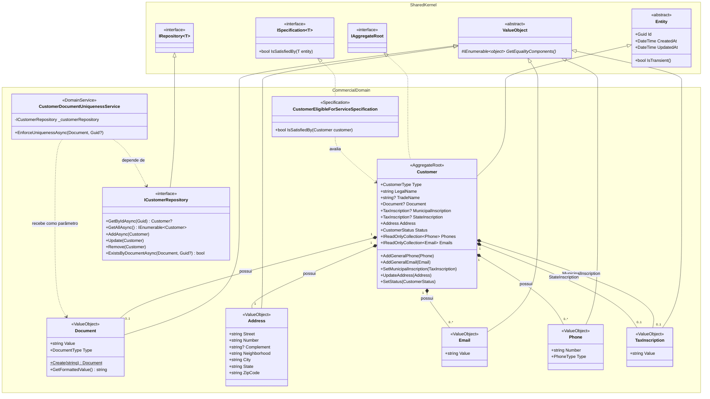

# Projeto de Disciplina: Modelagem de Domínios com Domain-Driven Design (DDD)
**Autor:** Matheus Mendes
**Projeto:** Control Service ERP

---

## 1. Contexto do Domínio e Problema de Negócio

O Control Service ERP é um sistema de gestão integrado para empresas prestadoras de serviços especializados de dedetização, higienização de reservatórios e impermeabilização. O sistema controla o ciclo completo do serviço, do agendamento comercial à emissão de relatórios regulatórios, com execução móvel em campo e controle financeiro. 

O grande problema de negócio resolvido pelo sistema é a conformidade regulatória obrigatória junto ao INEA (Instituto Estadual do Ambiente) através do Relatório de Acompanhamento das Atividades de Empresas (RAAE), eliminando inconsistências manuais e garantindo que operações em locais sem conectividade (subsolos, áreas rurais) não impactem a prestação do serviço.

### Atores e Especialistas de Domínio

O processo de exploração e modelagem deste domínio não ocorreu de maneira isolada ou puramente acadêmica. A extração das regras de negócio e a consolidação do conhecimento foram conduzidas por mim, desenvolvedor e arquiteto do sistema, atuando simultaneamente como o **Especialista de Domínio Principal**.

Como Coordenador Administrativo da empresa prestadora de serviços há mais de 5 anos, fui responsável por gerenciar a transição operacional entre dois ERPs distintos. Essa experiência prática diária no gerenciamento de processos e no treinamento das equipes me forneceu um entendimento profundo das deficiências dos sistemas de mercado e das necessidades reais do negócio, garantindo que o modelo que proponho reflita as verdadeiras complexidades e fluxos da nossa organização.

O conhecimento do domínio é descentralizado e compartilhado entre diferentes perfis de especialistas dentro da nossa organização. A minha modelagem tática e estratégica foi baseada nas interações diárias, processos e dores dos seguintes atores:

**1. Especialista em Regras de Negócio e Processos (Coordenador Administrativo / Eu)**
- **Papel:** Tenho a visão macro do negócio, entendimento claro das falhas nos sistemas anteriores e sou responsável por orquestrar os fluxos entre setores da empresa.
- **Contribuição na Modelagem:** Defini as regras de transição de estado das Ordens de Serviço, modelei o multitenancy lógico (múltiplos CNPJs) e estruturei as regras de validação para a emissão de relatórios regulatórios (RAAE).

**2. Operadores Comerciais**
- **Papel:** Atuam no dia a dia do nosso escritório lidando diretamente com os clientes. São responsáveis pela captação de *leads*, agendamento de serviços, gestão do relacionamento, elaboração de propostas e todo o acompanhamento comercial e burocrático.
- **Contribuição na Modelagem:** Forneceram os jargões comerciais e me ajudaram a mapear o fluxo de um serviço desde a aprovação da proposta até a geração do itinerário de serviços. Identificamos juntos os ciclos de vida de garantias e renovações de contratos.

**3. Operadores de Campo (Técnicos)**
- **Papel:** Executam a prestação do serviço na ponta final (dedetização, higienização de reservatórios, impermeabilização). Operam diretamente nos endereços dos nossos clientes.
- **Contribuição na Modelagem:** A realidade de campo deles moldou a arquitetura *Offline-First* do aplicativo. Seus relatos práticos definiram meu modelo tático no que tange aos registros de insumos consumidos (produtos químicos) e o preenchimento de informações pós-serviço (as baixas).

**4. Operadores Financeiros**
- **Papel:** Responsáveis pelo fluxo de caixa e obrigações fiscais e financeiras da empresa.
- **Contribuição na Modelagem:** Me ajudaram a definir regras estritas do negócio, como, por exemplo, a regra de que um serviço só pode transitar para o estado "Pronto para Faturar" quando certas pré-condições operacionais forem rigorosamente cumpridas pelo Operador de Campo e confirmadas pelo Operador Comercial.

---

## 2. Linguagem Ubíqua Definida

Para garantir que não haja ambiguidades entre o negócio e o software, estabelecemos um dicionário compartilhado (Linguagem Ubíqua). Esses termos são utilizados estritamente nas discussões de domínio, nomes de classes, variáveis e no banco de dados:

- **Service Nature (Natureza de Serviço):** Categoria macro do serviço prestado. Divide o modelo operacional em três vertentes principais: Dedetização, Higienização de Reservatórios e Impermeabilização.
- **Service Object (Objeto de Serviço):** O alvo específico do tratamento dentro de uma *Service Nature* (ex: *barata* e *rato* para dedetização; *caixa d'água* para higienização). O *Service Object* dita regras operacionais, como o tempo de garantia do serviço.
- **Itinerary (Itinerário):** O agrupamento e a programação diária de todos os serviços que um Operador de Campo (ou equipe técnica) deve executar em um dado dia.
- **Service Order (Ordem de Serviço):** Documento técnico gerado para um serviço específico, possuindo numeração sequencial independente e dividida por *Service Nature*. O polimorfismo desse documento é uma regra vital:
  - *Service Order de Dedetização:* Deve obrigatoriamente listar todos os princípios ativos dos insumos químicos (*Chemical Products*) utilizados.
  - *Service Order de Higienização:* Exige a capacidade volumétrica e o relatório do estado e material de cada reservatório (ex: polietileno, concreto).
  - *Exceção de Domínio:* A natureza "Impermeabilização" não gera *Service Order*, pois não é regulamentada pelo INEA, evitando sobrecarga operacional desnecessária.
- **Service Checkout (Baixa do Serviço):** Ação executada pelo Operador de Campo para atualizar o status do serviço. Compreende o ato de marcar como concluído (ou não concluído) em conjunto com o preenchimento de um relatório relatando como foi a execução (ou o motivo do cancelamento/impedimento).
- **RAAE (Relatório de Acompanhamento das Atividades de Empresas):** Obrigação regulatória mensal exigida pelo órgão ambiental (INEA). É um relatório consolidado que segrega por *Service Nature* e consome todos os dados das *Service Orders* daquele mês. Seu objetivo é agregar as informações críticas (ex: total de *Chemical Products* utilizados no mês, ou o quantitativo e capacidades de reservatórios higienizados).

---

## 3. Bounded Contexts e Context Map

O sistema foi estrategicamente particionado utilizando o estilo **Monólito Modular**, organizado em 5 Bounded Contexts principais, baseados na coesão conceitual e autonomia de regras de negócio:

1. **Contexto de Gerenciamento:** Configuração centralizada, cadastros base, perfis de permissão, isolamento de CNPJs (multitenancy) e motor de templates de documentos.
2. **Contexto Comercial:** Gerenciamento de clientes, propostas, renovações de serviços e agendamento de itinerários. Detém a responsabilidade sobre o ciclo de vendas e relacionamento.
3. **Contexto Operacional:** Execução no campo. Lida com as regras *offline-first*, garantias, uso de insumos químicos e efetivação das "baixas" de serviço.
4. **Contexto Financeiro:** Fluxo de caixa, recebíveis, pagáveis, cálculos de comissões e emissão de notas fiscais (comunicação com serviços externos).
5. **Contexto de Relatórios:** Conformidade regulatória (RAAE) e auditorias de divergência.

**Context Map (Relacionamentos e Padrões):**
Mapeando as interações da arquitetura, estabelecemos os seguintes padrões de relacionamento entre os contextos:
- **Customer/Supplier (Upstream: Comercial → Downstream: Operacional, Financeiro e Relatórios):** O Contexto Comercial atua como o "dono da verdade" e centralizador das Ordens de Serviço e Clientes. O Operacional (que envia as baixas), o Financeiro (que processa faturamentos manuais) e o módulo de Relatórios (que gera o RAAE) consomem as informações geradas pelo Comercial. Mudanças no Comercial exigem alinhamento e gestão cuidadosa com as necessidades de todos esses consumidores.
- **Conformist (Upstream: Gerenciamento → Downstream: Demais Contextos):** Todos os módulos conformam-se estritamente à injeção de *claims* de perfil e `tenant_id` fornecidos pelo Gerenciamento.
- **Anti-Corruption Layer (ACL):** Utilizado pelo Contexto Financeiro na comunicação com a "API de Notas Fiscais SaaS" externa. Envelopamos essa integração com interfaces do domínio (Gateways), isolando nosso modelo financeiro interno das oscilações, regras exóticas e complexidades das APIs de cada prefeitura.

---

## 4. Identificação do Core Domain

O **Core Domain** (Coração do Negócio) deste sistema é o **Contexto Comercial**. 

**Justificativa:** 
É o módulo Comercial que justifica a existência e a verdadeira entrega de valor do ERP. Ele é o núcleo orquestrador que centraliza processos do gerenciamento e possibilita o funcionamento dos demais domínios. É o Comercial que detém o manuseio e a inteligência sobre clientes e contratos de prestação de serviços. 

Sem a prospecção, o cadastro da proposta e o agendamento gerado no módulo Comercial, o módulo Operacional não tem itinerário para executar; o Financeiro não possui base para faturar; e o módulo de Relatórios não possui insumos para formatar as exigências regulatórias (RAAE). O diferencial competitivo da organização depende intrinsecamente de um fluxo de vendas dinâmico, renovação proativa de garantias e um relacionamento blindado com o cliente.

Os demais contextos foram classificados taticamente como:
- **Supporting Domains:** Operacional (execução da atividade em campo) e Relatórios (Conformidade INEA). Eles apoiam o serviço vendido.
- **Generic Domains:** Financeiro (recebíveis e nota fiscal) e Gerenciamento (autenticação e segurança), cujas lógicas de negócio poderiam ser facilmente delegadas a sistemas genéricos de prateleira.

---

## 5. Modelo Tático (Entidades, Value Objects, Agregados)

A modelagem tática do nosso Core Domain gira em torno de duas Raízes de Agregado principais: **Customer** (Cliente) e **Order** (Pedido).

**1. Agregado: Customer (Cliente)**
- **Raiz do Agregado (`Aggregate Root`):** `Customer`. É a entidade principal que carrega todas as informações vitais de contato e faturamento.
- **Value Objects:** As propriedades do cliente foram modeladas como *Value Objects* imutáveis para garantir validação intrínseca. Exemplos adotados: `Document` (CPF/CNPJ), `Email`, `Phone` e `Address`. Um `Customer` não pode existir no sistema em um estado inválido (ex: sem um documento válido).

**2. Agregado: Order (Pedido)**
- **Raiz do Agregado (`Aggregate Root`):** `Order`. Ele atua como o orquestrador transacional do trabalho comercial.
- **Entidades Internas:** `Service` (Serviço ou Etapa). Cada `Order` é composto por uma coleção de 1 a N `Services`. 
- **Value Objects e Propriedades da Entidade:** O `Service` carrega referências imutáveis para a `Service Nature` e os `Service Objects` correspondentes. É ele quem recebe os relatos da execução em campo, como a quantidade de `Chemical Products` utilizados ou registros fotográficos de não-conformidades no endereço do cliente (ex: muito lixo espalhado ou locais sem acesso).
- **Invariantes:** A raiz `Order` garante que não existam "Serviços Órfãos". Um `Service` só pode ser adicionado, alterado ou ter seu agendamento manipulado através da sua raiz `Order`. Isso protege a integridade transacional do contrato firmado com o `Customer`.

---

## 6. Domain Services e Repositórios

**Repositórios:**
O modelo isola a persistência através do padrão *Repository*, utilizando a interface genérica `IRepository<T>` em conjunto com o `SharedKernel`. O domínio define interfaces restritas (ex: `ICustomerRepository`), enquanto a camada de Infraestrutura as implementa acoplando-se ao Entity Framework Core. Isso garante que a camada de Domínio permaneça pura, sem vazamento de detalhes de tabelas ou SQL.

**Padrão Specification (`ISpecification<T>`):**
Implementei a interface genérica `ISpecification<T>` no `SharedKernel/SeedWork`, que estabelece o contrato `IsSatisfiedBy(T entity)` como base reutilizável para qualquer regra de elegibilidade futura. A primeira implementação concreta é a `CustomerEligibleForServiceSpecification`, que encapsula o critério de elegibilidade de um `Customer` para ter um serviço agendado:

1. O `Customer` deve ter um `Document` (CPF/CNPJ) válido cadastrado.
2. O `Customer` deve ter um `LegalName` (Nome ou Razão Social) preenchido.
3. O `Customer` deve possuir um `Address` (Endereço) cadastrado.

A separação da regra em uma *Specification* permite que ela seja testada de forma unitária e isolada, e reutilizada por diferentes *Application Services* (ex: criação de Order, validação de proposta) sem duplicar a lógica de validação nos agregados.

**Domain Service (`CustomerDocumentUniquenessService`):**
Criamos o serviço de domínio `CustomerDocumentUniquenessService` para resolver uma regra de negócio que nenhum Aggregate consegue cumprir sozinho: a garantia de unicidade do `Document` (CPF/CNPJ) na base de clientes do *tenant* corrente. Um `Aggregate` não pode injetar repositórios — essa é uma invariante de DDD. O Domain Service resolve essa lacuna:

- É **stateless** (sem estado): toda informação necessária é recebida como parâmetro.
- Depende exclusivamente da porta `ICustomerRepository` via inversão de dependência (DIP), sem acoplamento com nenhum detalhe de infraestrutura.
- Expõe o método `EnforceUniquenessAsync(document, excludedCustomerId?)`: se o documento já existir em outro `Customer`, lança uma `DomainException` com mensagem descritiva — em vez de retornar um código de erro ou `null`.
- O parâmetro opcional `excludedCustomerId` suporta cenários futuros de atualização, onde o próprio cliente não deve ser considerado duplicado.
- É invocado pelo `CreateCustomerCommandHandler` (camada de Application) antes da persistência, respeitando o fluxo: *Application orquestra, Domain Service contém a regra, Aggregate encapsula o estado*.

---

## 7. Discussão sobre regras, invariantes e evolução do modelo

O ciclo de vida do domínio reflete a passagem dos objetos de negócio através dos contextos limitados, respeitando rigorosamente as fronteiras de responsabilidade:

1. **Geração e Orquestração (Comercial):** O fluxo depende da pré-existência dos dados base (*Service Natures*, *Service Objects*, *Chemical Products*) e de um `Customer` íntegro. O ciclo começa com a geração de uma `Order` no setor Comercial, contendo seus devidos `Services` atrelados.
2. **Delegação e Execução (Operacional):** Os `Services` são enviados para a fila do contexto Operacional (*Itineraries*). O Operador de Campo executa a tarefa offline e registra o consumo de *Chemical Products* e anomalias do ambiente.
3. **Transição de Estado (Service Checkout):** A baixa (*Checkout*) de um serviço conclui o ciclo tático de campo. Ela engatilha a atualização de status do serviço no banco de dados e anexa todos os relatos técnicos da operação.
4. **Independência de Faturamento (Financeiro):** Uma decisão consciente de negócio é não atrelar o *Service Checkout* ao faturamento automático. Como cada `Customer` possui particularidades contratuais severas, o módulo Financeiro atua de forma autônoma: o faturamento de uma `Order` fechada requer sempre a tomada de decisão humana de um operador financeiro.
5. **Garantia de Lisura (Relatórios):** Assim que o *Checkout* ocorre, os dados fluem para o módulo de Relatórios de forma contínua, compondo gradualmente o RAAE. Para assegurar a lisura do processo real, o sistema permite a *reversibilidade* do checkout (correção de informações inseridas erroneamente). O modelo reage a essa reversão re-computando o relatório ambiental de maneira consistente, sem ferir as leis do INEA.

---

## 8. Considerações sobre maleabilidade e impacto arquitetural

A maleabilidade da arquitetura e a integridade do domínio são mantidas através da adoção estrita da **Arquitetura Limpa** e do **Monólito Modular**. As dependências de código-fonte apontam exclusivamente para dentro, em direção às abstrações de maior nível de política (o núcleo do Domínio). 

Para evitar a quebra do isolamento e o antipadrão *Big Ball of Mud*, foram tomadas decisões rigorosas de design:
- **Testes de Arquitetura (NetArchTest):** Agem como uma *Fitness Function* que garante de forma automatizada (durante a integração contínua) que nenhum módulo referencie diretamente classes de implementação de outro módulo. Toda a comunicação ocorre via contratos (interfaces) puras.
- **Multitenancy Lógico Transparente:** O isolamento de dados por CNPJ não polui as consultas de domínio. Ele é resolvido no nível da persistência via *Global Query Filters* injetados com um `ITenantContext`, reduzindo a complexidade cognitiva ao modelar regras de negócio.
- **Anti-Corruption Layer (ACL):** Integrações instáveis de terceiros, como a emissão de Nota Fiscal via SaaS, foram isoladas usando portas e adaptadores (`INotaFiscalGateway`), protegendo o Bounded Context Financeiro das oscilações de APIs de prefeituras e garantindo uma linguagem uniforme dentro do domínio.

Caso o escalonamento da equipe exija uma migração futura para serviços independentes, o *Strangler Fig Pattern* poderá ser aplicado facilmente, extraindo-se um dos Bounded Contexts coesos e substituindo as invocações locais por Sagas assíncronas baseadas em eventos de domínio.

---

## 9. Tradução do Modelo para Código

Um dos objetivos centrais do DDD é garantir que o modelo conceitual seja rastreável diretamente no código-fonte. Nesta seção, demonstro como cada elemento da Linguagem Ubíqua e das decisões táticas descritas ao longo deste relatório se materializaram em estruturas concretas de C#.

### 9.1 Diagrama de Classes do Core Domain

O diagrama abaixo representa a estrutura de classes implementada no `Bounded Context Comercial`. Ele evidencia a coerência entre o modelo conceitual, a Linguagem Ubíqua e o código produzido:

### 9.2 Rastreabilidade entre Linguagem Ubíqua e Código

A tabela a seguir mapeia cada conceito da Linguagem Ubíqua definida na Seção 2 à sua representação direta no código C# produzido:

| Conceito (Linguagem Ubíqua) | Artefato de Código | Namespace / Camada |
|---|---|---|
| `Customer` (Aggregate Root) | `class Customer : Entity, IAggregateRoot` | `Commercial.Domain.Customers` |
| `Document` (CPF/CNPJ) | `class Document : ValueObject` | `Commercial.Domain.Customers.ValueObjects` |
| `Address` (Endereço) | `class Address : ValueObject` | `Commercial.Domain.Customers.ValueObjects` |
| `Email` | `class Email : ValueObject` | `Commercial.Domain.Customers.ValueObjects` |
| `Phone` | `class Phone : ValueObject` | `Commercial.Domain.Customers.ValueObjects` |
| Regra de elegibilidade para `Service` | `CustomerEligibleForServiceSpecification : ISpecification<Customer>` | `Commercial.Domain.Customers.Specifications` |
| Unicidade de documento por tenant | `CustomerDocumentUniquenessService` | `Commercial.Domain.Customers.Services` |
| Porta de persistência do `Customer` | `ICustomerRepository : IRepository<Customer>` | `Commercial.Domain.Customers` |

### 9.3 Decisões de Implementação Relevantes

As principais decisões de implementação que evidenciam a tradução fiel do modelo para o código são:

**Imutabilidade dos Value Objects:** Todos os Value Objects (`Document`, `Address`, `Email`, `Phone`, `TaxInscription`) herdam de `ValueObject` e expõem suas propriedades apenas como getters (`{ get; }`). Sua criação é controlada por construtores privados ou factory methods estáticos (ex: `Document.Create(string)`), que realizam toda a validação de domínio na instanciação — garantindo que um objeto inválido jamais seja criado.

**Invariantes encapsuladas no Aggregate Root:** A classe `Customer` mantém suas propriedades com `private set`, de modo que o único caminho para alterar o estado do agregado é por meio dos seus métodos de domínio explícitos (`UpdateAddress`, `SetStatus`, `AddGeneralEmail`, etc.). Isso impede que qualquer código externo ao agregado quebre suas invariantes.

**Specification como regra explícita e testável:** A `CustomerEligibleForServiceSpecification` implementa a interface genérica `ISpecification<T>` definida no `SharedKernel`. Ela encapsula a regra de que um `Customer` deve possuir um `Document` válido, um `LegalName` e um `Address` cadastrados para ser elegível ao agendamento de serviços. Por ser uma classe isolada, ela é testada unitariamente de forma trivial e pode ser reutilizada por múltiplos Application Services.

**Domain Service como orquestrador stateless:** O `CustomerDocumentUniquenessService` é a prova concreta de um comportamento que não pertence a nenhum agregado isolado: a verificação de unicidade de CPF/CNPJ requer consultar o repositório, o que um `Aggregate Root` — por princípio — não pode fazer. O serviço é `stateless`, depende exclusivamente da porta `ICustomerRepository` via injeção de construtor, e sua invocação ocorre na camada de Application (`CreateCustomerCommandHandler`), mantendo a separação de responsabilidades intacta.
