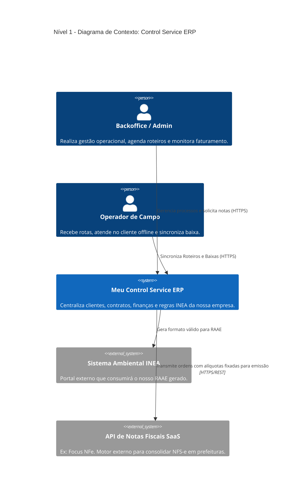
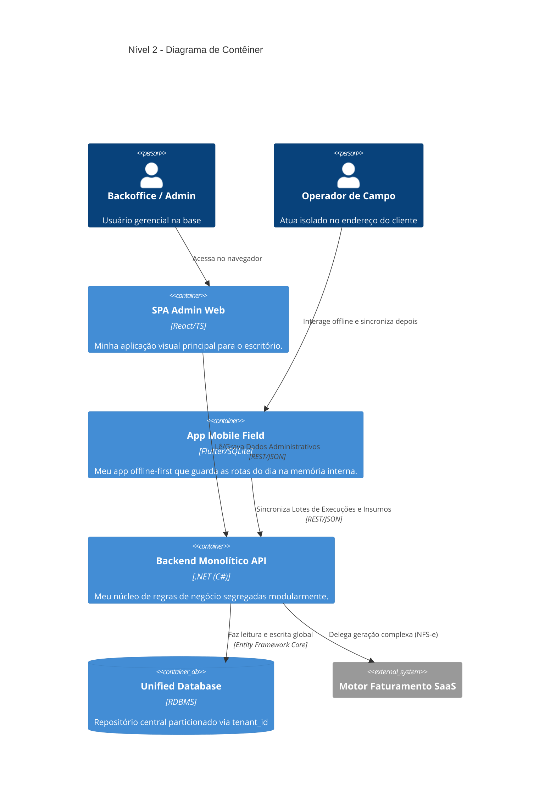
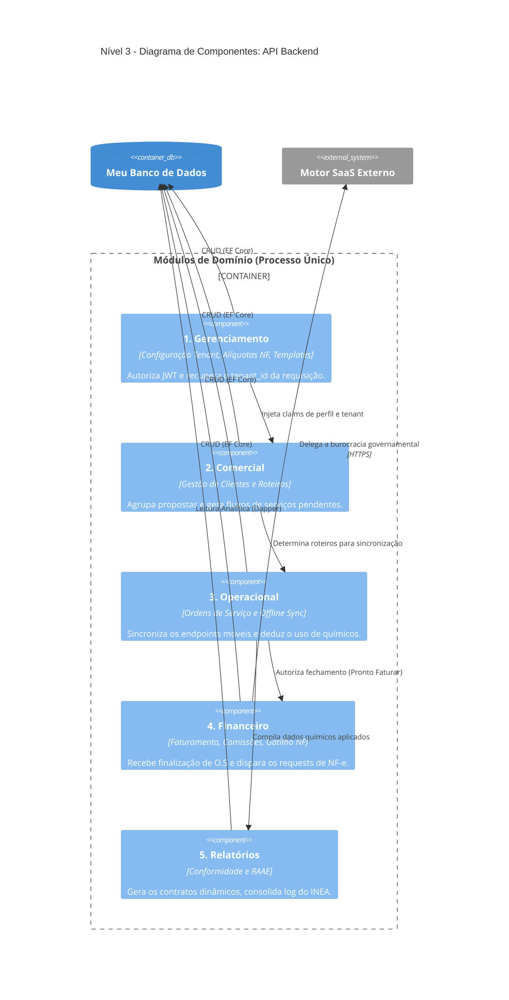

## 5. Comunicação da Arquitetura - Modelo C4
O modelo C4 (escrito em formato adaptado de fluxos) orienta a minha visão estrutural do sistema de forma coerente.

### 5.1 Nível 1: Diagrama de Contexto
Demonstra a interação primordial entre as Personas da nossa empresa, o meu ERP e sistemas externos.

### 5.2 Nível 2: Diagrama de Contêiner
Explícita os meus limites técnicos implantáveis (quanta lógico).

### 5.3 Nível 3: Diagrama de Componentes (Foco no Backend API)
Foco exclusivo para demonstrar como modelei o padrão de *Domain Partitioning* justificado.

