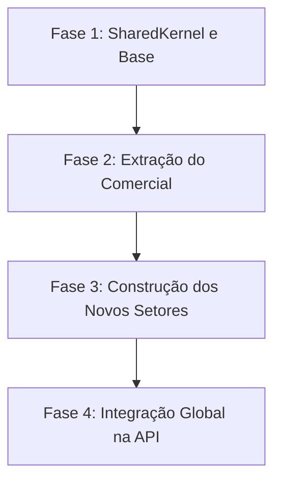

# Plano de Transição Arquitetural: Monólito Modular por Projetos de Domínio
**Projeto:** Control Service ERP  
**Autor:** Antigravity (AI Co-Pilot)  
**Data:** 19 de Maio de 2026  
**Status:** Proposto  

---

## 1. Visão Geral da Arquitetura Proposta

Este documento define o plano detalhado de transição da atual arquitetura baseada em **Particionamento Técnico de Topo** (camadas de API, Application, Domain e Infrastructure globais) para um **Monólito Modular por Projetos de Domínio (Particionamento de Topo por Setor)**, aplicando as diretrizes de *Fundamentals of Software Architecture* (Richards & Ford) e *Clean Architecture* (Robert C. Martin).

### 1.1 Motivação e Justificativa (A Segunda Lei da Arquitetura)
A **Segunda Lei da Arquitetura de Software** estabelece que *o porquê é mais importante que o como*. O redirecionamento físico do sistema apoia-se em drivers de negócio muito claros:
* **Screaming Architecture:** A raiz da pasta `src` deve "gritar" os domínios fundamentais do ERP (**Gerenciamento**, **Comercial**, **Operacional**, **Financeiro** e **Relatórios**), tornando as intenções do negócio imediatamente visíveis para o desenvolvedor solo.
* **Governança por Compilador (Fitness Function Automatizada):** Em uma equipe enxuta, o compilador do .NET será o principal garantidor do isolamento de limites. Impedir conexões impróprias entre setores (ex: Operacional dependendo diretamente de regras de faturamento do Financeiro) evita a degradação estrutural do software a médio e longo prazo.
* **Isolamento de Mudanças e CCP (Common Closure Principle):** Garantir que mudanças nas diretrizes do INEA (setor de Relatórios) ou modificações de templates dinâmicos (setor de Gerenciamento) impactem apenas os arquivos sob seu próprio domínio, reduzindo drasticamente o risco de regressões e a fragilidade de testes.
* **Facilidade de Extração Operacional (Drivers de Execução Offline):** Conforme documentado no relatório técnico, a operação em campo móvel offline é um ponto crítico. Isolar o módulo `Operational` em um projeto autocontido viabiliza que, no futuro, ele seja extraído física e operacionalmente para um novo *Quantum Arquitetural* (Microsserviço ou API isolada) sem demandar uma reescrita catastrófica no ERP principal.

---

## 2. Nova Topologia de Projetos (.csproj)

A solução será dividida fisicamente em projetos que separam os **Setores de Negócio** no nível mais alto, mantendo internamente a divisão lógica de Clean Architecture para garantir a inversão de dependências.

### 2.1 Visão da Árvore de Diretórios (`src/`)

```text
src/
├── ControlService.SharedKernel/            # [NOVO] Abstrações comuns e utilitários sem domínio (estável e reutilizável)
│   ├── SeedWork/                           # Entidades bases, Value Objects, interfaces de repositórios globais
│   └── Behaviors/                          # Logging, Validation e Transações do MediatR
│
├── ControlService.Management/              # [NOVO] Setor 1: Gerenciamento (Cadastro de CNPJs, permissões, templates)
│   ├── Domain/                             # Entidades de Domínio e Regras do Setor
│   ├── Application/                        # Casos de Uso (Commands, Queries, Handlers)
│   └── Infrastructure/                     # Persistência (ManagementDbContext, Migrations do Setor)
│
├── ControlService.Commercial/              # [NOVO] Setor 2: Comercial (Clientes, propostas, roteiros)
│   ├── Domain/
│   ├── Application/
│   └── Infrastructure/                     # CommercialDbContext (Clientes e Propostas)
│
├── ControlService.Operational/             # [NOVO] Setor 3: Operacional (Execução em campo offline, operadores)
│   ├── Domain/
│   ├── Application/
│   └── Infrastructure/                     # OperationalDbContext (Execuções, ordens de serviço, químicos)
│
├── ControlService.Financial/               # [NOVO] Setor 4: Financeiro (Contas a pagar/receber, faturamento)
│   ├── Domain/
│   ├── Application/
│   └── Infrastructure/                     # FinancialDbContext (Títulos, faturas, comissões)
│
├── ControlService.Reporting/               # [NOVO] Setor 5: Relatórios (Conformidade INEA, RAAE, balanço de vendas)
│   ├── Domain/
│   ├── Application/
│   └── Infrastructure/                     # ReportingDbContext (Views otimizadas de leitura, RAAE logs)
│
└── ControlService.API/                     # [MODIFICADO] Componente "Main" (Hospedagem Web e Endpoints)
    ├── Controllers/                        # Controllers organizados por subpastas de negócio
    ├── Properties/
    ├── appsettings.json
    └── Program.cs                          # Registro centralizado de IoC e inicialização do sistema
```

### 2.2 Grafo de Dependências e Princípios de Acoplamento
Para manter o grafo acíclico e estável, as dependências devem seguir rigorosamente estes princípios:
* **ADP (Acyclic Dependencies Principle):** Sem dependências circulares. Um módulo de negócio **nunca** referencia outro diretamente no compilador.
* **SDP (Stable Dependencies Principle):** Depender apenas na direção da estabilidade. O projeto `ControlService.SharedKernel` é o mais estável do sistema (quase nunca muda) e todos os projetos de Domínio podem depender dele.
* **Comunicação Cross-Domain:** Se o `Financial` precisa de dados do `Commercial` (ex: obter os dados de um cliente faturado), ele **não** referencia as classes de domínio do Comercial. Ele expõe a sua própria interface de infraestrutura de leitura ou consome serviços através de barramento em memória (como o `MediatR` despachando comandos na camada de API).

---

## 3. Estratégia de Persistência com Múltiplos DbContexts

Para apoiar a Opção A com modularidade estrita de banco, utilizaremos a **Abordagem de DbContexts Isolados por Módulo**, todos apontando para a mesma base física de dados.

### 3.1 Bounded Contexts e Identificação por IDs Simples
Evitaremos chaves estrangeiras com propriedades de navegação do Entity Framework que cruzem as barreiras físicas dos módulos.
* **Incorreto (Acoplamento Forte):**
  ```csharp
  namespace ControlService.Operational.Domain;
  public class ServiceRoute {
      public Guid Id { get; set; }
      public ControlService.Commercial.Domain.Customer Customer { get; set; } // Violação de Limites!
  }
  ```
* **Correto (Acoplamento Fraco/Modular):**
  ```csharp
  namespace ControlService.Operational.Domain;
  public class ServiceRoute {
      public Guid Id { get; set; }
      public Guid CustomerId { get; set; } // Apenas o ID conceitual da relação
  }
  ```

### 3.2 Isolamento de DbContexts e Migrations
* Cada projeto `.Infrastructure` possuirá o seu próprio `DbContext` especializado, contendo apenas o mapeamento do seu domínio.
* Para evitar colisões e manter o controle exato do banco de dados, configuraremos o histórico de migrations (`__EFMigrationsHistory`) de forma individualizada para cada DbContext.

Exemplo de configuração da infraestrutura do Comercial (`CommercialDbContext.cs`):
```csharp
protected override void OnConfiguring(DbContextOptionsBuilder optionsBuilder)
{
    optionsBuilder.UseNpgsql(
        _connectionString,
        x => x.MigrationsHistoryTable("__EFMigrationsHistory_Commercial", "public")
    );
}
```

Desta forma, cada módulo gerencia suas tabelas sob a sua própria "tabela de histórico de migrações", isolando as mudanças estruturais e facilitando consideravelmente a manutenção e o eventual desmembramento de bancos.

---

## 4. Fases de Implementação (Faseamento Pragmático)

Para mitigar riscos e não paralisar o desenvolvimento ativo, a reestruturação será realizada em **quatro fases consecutivas e incrementais**.



### Fase 1: Criação da Estrutura de Projetos e Migração do SharedKernel
* **Objetivo:** Estabelecer a fundação comum e configurar a solução para a nova topologia física.
1. Criar o diretório `src/ControlService.SharedKernel` com uma biblioteca de classes `.NET Core`.
2. Mover o conteúdo de `ControlService.Domain/SeedWork` (ex: `Entity.cs`, `ValueObject.cs`, `IAggregateRoot.cs`) para o novo `SharedKernel`.
3. Mover `ControlService.Application/Behaviors` para o `SharedKernel`.
4. Adicionar a referência do `SharedKernel` nos projetos legados temporários para evitar quebras durante a transição.

### Fase 2: Extração Modular do Setor Comercial (Piloto)
* **Objetivo:** Isolar o domínio já existente em projetos próprios, validando o padrão arquitetural antes de expandir.
1. Criar a pasta de nível superior `src/ControlService.Commercial/`.
2. Adicionar três novos projetos sob essa pasta:
   * `ControlService.Commercial.Domain.csproj`
   * `ControlService.Commercial.Application.csproj`
   * `ControlService.Commercial.Infrastructure.csproj`
3. Migrar os arquivos lógicos de `src/ControlService.Domain/Commercial/` para o novo projeto de domínio comercial. Ajustar os namespaces.
4. Migrar os arquivos de `src/ControlService.Application/Commercial/` para o projeto de aplicação correspondente.
5. Migrar os repositórios, injeções e DbContext associados de `src/ControlService.Infrastructure/` para a infraestrutura do Comercial.
6. Ajustar as dependências internas e referências no novo projeto do Comercial.
7. Atualizar as referências na API e testar o funcionamento completo do endpoint `/api/customers`.

### Fase 3: Estruturação dos Módulos Remanescentes
* **Objetivo:** Criar as estruturas de pastas físicas e projetos para os 4 setores que serão desenvolvidos na sequência.
1. Criar as pastas de topo correspondentes a:
   * `src/ControlService.Management/`
   * `src/ControlService.Operational/`
   * `src/ControlService.Financial/`
   * `src/ControlService.Reporting/`
2. Gerar os três projetos constituintes para cada um deles (Domain, Application, Infrastructure).
3. Configurar a referência do `SharedKernel` em todos eles.
4. Mapear nos DbContexts respectivos a conexão física do banco de dados unificado, isolando suas tabelas e históricos de migrações (`__EFMigrationsHistory_[Modulo]`).

### Fase 4: Integração Global e Limpeza na API (O "Main")
* **Objetivo:** Organizar a camada de entrada e descartar os 3 projetos legados globais antigos.
1. Ajustar o `ControlService.API` para referenciar individualmente cada um dos novos projetos de aplicação (`.Commercial.Application`, `.Operational.Application`, etc.).
2. No arquivo `Program.cs`, centralizar o registro de serviços (`IServiceCollection`) chamando os métodos de extensão de cada infraestrutura de negócio (ex: `services.AddCommercialInfrastructure()`, `services.AddOperationalInfrastructure()`).
3. Organizar os Controllers HTTP na API dentro de diretórios correspondentes aos setores para manter a Screaming Architecture em todas as frentes de visualização.
4. Remover fisicamente os projetos antigos vazios: `ControlService.Domain.csproj`, `ControlService.Application.csproj` e `ControlService.Infrastructure.csproj`.

---

## 5. Estratégias de Mitigação de Riscos Técnicos

### 5.1 Consultas de Leitura Complexas Cruzadas (Reports)
**O Risco:** Em monólitos modulares com múltiplos DbContexts e sem chaves de navegação física, realizar consultas que cruzam dados de diferentes módulos (ex: Gerar o Balanço de Vendas no Financeiro necessitando de dados detalhados de Clientes do Comercial) pode se tornar ineficiente se feito em memória.
**A Mitigação:** 
* Adotar o princípio do **CQRS na Leitura**. O módulo `Reporting` pode possuir um `ReportingDbContext` contendo mapeamentos diretos apenas para Views de Banco de Dados.
* Essas Views SQL físicas no PostgreSQL se encarregam de fazer os joins altamente eficientes entre as tabelas físicas na base de dados, enquanto o código C# apenas lê dados desnormalizados otimizados para exibição.

### 5.2 Gerenciamento de Transações ACID Multidomínio (Sagas em Processo)
**O Risco:** O fluxo de dados dita que quando uma O.S. for concluída no Operacional, o Financeiro deve gerar o faturamento. Se a geração financeira falhar, a O.S. não deve permanecer marcada como faturada.
**A Mitigação:**
* Dado que estamos no mesmo processo físico e compartilhamos a mesma base de dados PostgreSQL, podemos criar um middleware ou serviço orquestrador de transações globais no componente API que envolve as chamadas dos dois módulos em uma transação do EF Core explícita no mesmo banco.
* Alternativamente, podemos disparar eventos de domínio assíncronos em memória usando o `MediatR` com processamento transacional distribuído lógico (Saga em processo), preservando a resiliência e a capacidade futura de migração para filas de mensageria assíncronas reais.

---

## 6. Governança da Arquitetura (Fitness Functions)

Para garantir que os desenvolvedores atuais e futuros não violem a estrutura de projetos adotada neste plano, será implementado na suíte de testes o uso de **Fitness Functions automatizadas** com a biblioteca `NetArchTest.eNet` ou `ArchUnitNET`.

Exemplo de teste estrutural a ser adicionado:
```csharp
[Fact]
public void Domain_Should_Not_Have_Dependency_On_Other_Projects()
{
    var domainAssembly = typeof(Commercial.Domain.Customer).Assembly;
    
    var result = Types.InAssembly(domainAssembly)
        .ShouldNot()
        .HaveDependencyOnAll("ControlService.Infrastructure", "ControlService.API", "ControlService.Financial")
        .GetResult();

    Assert.True(result.IsSuccessful);
}
```
Estes testes rodarão integrados na pipeline de CI, bloqueando qualquer PR que viole o isolamento dos limites físicos propostos na arquitetura deste ERP.
